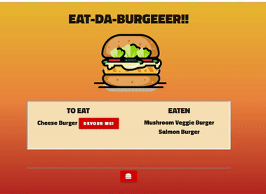
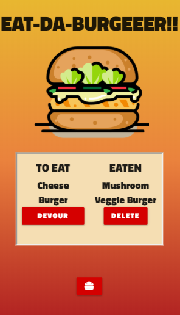

# Burger 2 The Sequel

  

### Description

This application it's a Burger logger built with h MySQL, Node, Express, Handlebars and Sequelize.    I used Node and MySQL to query and route data and Handlebars to generate HTML.

*Key words* : 
*Servers*, *Express.js*, *MySQL* , *API routes*, *Handeblars*, *Object-relational mapping*, *Model-View-Controller*, *Template engines* ,*Sequelize*

### Technologies used 
Express.Js  
Postman  
Handlebar.js  
Materialize  
Sequelize

### Link 
Check it out!

https://radiant-waters-32407.herokuapp.com/

  

